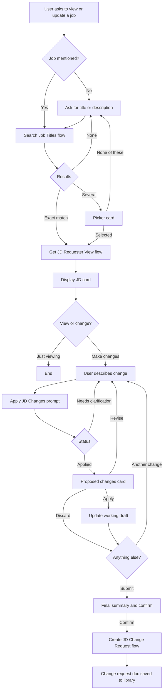

# Job Description Expert Agent — Build Guide
**Sections covered:** General (knowledge expert) and Update (view / edit existing JDs)
**Platform:** Microsoft Copilot Studio (classic experience), Power Automate, SharePoint, Word
**Version:** 1.3 — September 16, 2026 (email removed; flow ends at a saved change request document)

---

## How to use this guide

Work through the phases in order. Each phase ends with a **checkpoint** — don't move on until it passes, because later phases depend on earlier outputs (especially the JSON field keys defined in Phase 0).

The JSON keys in the Phase 0 field map are used everywhere: flow outputs, Parse value schemas, the prompt, the Word template, and the submit flow. Define them once and never rename them.

---

## Architecture at a glance

| Component | Type | Purpose | Status |
|---|---|---|---|
| JD Field Guide.md | Knowledge (file) | Answers "how do I fill out X" and field criteria | Exists — restructure in Phase 1 |
| Job Families.md | Knowledge (file) | Job family definitions, similar positions | Exists — restructure in Phase 1 |
| Job Descriptions list | SharePoint list | Source of truth for existing JDs (agent **reads only**) | Exists |
| Search Job Titles | Flow | Wraps `MatchJobTitle` + description-based fallback | New (reuses existing script) |
| Get JD Requester View | Flow | Job code → **user-visible fields only** | New (copy of Get JD Details) |
| Apply JD Changes | Prompt tool | Turns natural-language edits into a structured updated JD | New |
| Update or View Job Description | Topic | Search → select → display → edit loop → submit | New |
| JD Change Request template | Word .docx | Blank JD with highlighted changes (no HR-only fields) | New |
| Create JD Change Request | Flow | Diff, populate template, save to library | New |
| JD Templates / JD Change Requests | SharePoint libraries | Template storage / generated requests (HR access only) | New |
| Email to HR | Flow | Sends the saved document to HR | **Out of scope** — separate flow after the Create section |

### Update section flow



### Design principles

1. **The agent never writes to the master Job Descriptions list.** It produces a change request document. HR updates the list after approval.
2. **HR-only fields never enter the conversation.** Job Code, Grade, and Status are never returned to the agent as readable content, so neither the orchestrator nor the prompt can repeat them. Job Code is used only as an internal ID; Status is used only server-side to filter search; Grade isn't used in this build.
3. **The LLM proposes; the flow decides what's highlighted.** The submit flow compares original vs. updated field by field. Highlighting can't be hallucinated.
4. **Deterministic gate before submitting.** No change request is created until the user explicitly confirms, enforced by a condition node, not by the orchestrator.
5. **Agent-level knowledge only.** No topic-scoped knowledge sources (avoids the duplicate-response issue).
6. **Solution-aware from day one.** Environment variables and connection references for everything that differs between DEV, UAT, and QA.

---

## Phase 0 — Prep and decisions

### 0.1 Create the solution (DEV)

1. In the DEV environment, create a solution: **JD Expert Agent** (use your standard publisher).
2. Create these **environment variables** inside the solution:

| Name | Type | Example value (DEV) |
|---|---|---|
| `env_JD_SiteUrl` | Text | `https://citynational.sharepoint.com/sites/HR-JD` |
| `env_JD_ListName` | Text | `Job Descriptions` |
| `env_JD_ActiveStatus` | Text | `Active` (the Status value users are allowed to search) |
| `env_JD_RequestsLibrary` | Text | `JD Change Requests` |

3. Create **connection references** for: SharePoint, Excel Online (Business) (Office Script), Word Online (Business), and Microsoft Dataverse / AI Builder (Run a prompt).
4. Build every flow, prompt, and the agent **from inside the solution**.

### 0.2 Field map

Find each column's internal name in **List settings → click the column → the `Field=` value at the end of the URL**. Columns with slashes or spaces get encoded (e.g., `Salary/Hourly` usually becomes something like `Salary_x002f_Hourly`).

| SharePoint column | JSON key | Visible to user? | Requester can edit? | Where it appears | Column type to confirm |
|---|---|---|---|---|---|
| Job Title | `JobTitle` | Yes | Yes (flagged) | Card header | Text |
| Job Code | `JobCode` | **No** | No | Internal ID only | Text |
| Grade | `Grade` | **No** | No | Not used in this build | ? |
| Salary/Hourly | `PayType` | Yes | Suggest only (flagged) | Designations | Choice? |
| People Management | `PeopleManagement` | Yes | Suggest only (flagged) | Designations | Yes/No or Choice? |
| Sales/Non-Sales | `SalesDesignation` | Yes | Suggest only (flagged) | Designations | Choice? |
| Relationship Manager | `RelationshipManager` | Yes | Suggest only (flagged) | Designations | Yes/No or Choice? |
| NMLS Required | `NMLSRequired` | Yes | Suggest only (flagged) | Designations | Yes/No or Choice? |
| Purpose | `Purpose` | Yes | Yes | Body | Multi-line |
| Principal Duties and Responsibilities | `PrincipalDuties` | Yes | Yes | Body | Multi-line |
| Education Requirements | `EducationRequirements` | Yes | Yes | Body | Multi-line |
| Work Experience Requirements | `WorkExperienceRequirements` | Yes | Yes | Body | Multi-line |
| Knowledge Skills Abilities | `KSAs` | Yes | Yes | Body | Multi-line |
| Certifications/Licenses | `CertificationsLicenses` | Yes | Yes | Body | Multi-line |
| Status | `Status` | **No** | No | Search filter only | Choice? |

**Normalize designation fields to plain text in flows.** SharePoint returns Choice columns as objects (use `?['Value']`) and Yes/No columns as booleans (use `if(x, 'Yes', 'No')`). The agent and prompt should only ever see strings like `"Salary"`, `"Hourly"`, `"Sales"`, `"Non-Sales"`, `"Yes"`, `"No"`. Write down the exact allowed values for each — they go into the prompt in Phase 5.

> **Rich text gotcha:** If any multi-line columns are *Enhanced rich text*, SharePoint returns HTML. Convert those columns to plain text, or run them through **Html to text** before building JSON. Otherwise tags show up in cards, the prompt, and the Word document.

### 0.3 Decisions

| # | Decision | Recommended default |
|---|---|---|
| D1 | Emailing the document to HR (and a copy to the user) | **Deferred** to a separate flow after the Create section. This build stops at saving the document (see 7.3). |
| D2 | Who can open the JD Change Requests library? | HR only, since Job Code is stored as metadata |
| D3 | Can requesters change Salary/Hourly, People Management, Sales/Non-Sales, Relationship Manager, NMLS Required? | They can *request* it; it's always flagged for HR review |
| D4 | Description-based search ("the person who runs payroll")? | Yes — AI prompt fallback when fuzzy title score is low |
| D5 | Which Status values are searchable? | Active only (`env_JD_ActiveStatus`) |
| D6 | Who can use the agent? | Managers + HR (share via Teams / M365 Copilot to a security group) |

**✅ Checkpoint 0:** Solution, env vars, and connection references created; field map complete with internal names, column types, and allowed designation values; D1–D6 decided.

---

## Phase 1 — Prepare the knowledge files

Generative answers retrieves *chunks* of your files, not whole documents. Sections that stand on their own retrieve far better.

### 1.1 Restructure the JD Field Guide markdown

Use **one H2 per user-facing field**, using the same names as the SharePoint columns, each with the same subheadings:

```markdown
## Purpose
### What it is
### How to fill it out
### Criteria and requirements
### Good example
### Common mistakes
```

Fields to cover: Job Title, Salary/Hourly, People Management, Sales/Non-Sales, Relationship Manager, NMLS Required, Purpose, Principal Duties and Responsibilities, Education Requirements, Work Experience Requirements, Knowledge Skills Abilities, Certifications/Licenses.

Then add **one H2 per concept** users will ask about directly:

- `## People Management Designation` — what qualifies (direct reports, authority to hire/terminate or recommend it, performance reviews, directing others' work) and what doesn't (project lead, dotted line, training others)
- `## Salary vs. Hourly (FLSA Exempt vs. Non-Exempt)` — how your policy ties pay type to FLSA status and who decides
- `## Sales vs. Non-Sales Designation`
- `## Relationship Manager Designation`
- `## NMLS Requirement` — which roles need NMLS registration and why
- `## EEO Category` — the categories you use and how they're assigned
- `## Knowledge, Skills, and Abilities (KSAs)` — definitions, how to write them, examples
- `## Job Families and Similar Positions`

**Do not** document Grade, Job Code, or Status in the user-facing knowledge file. If the knowledge file explains grades, the agent can discuss them.

Formatting tips:
- Spell out acronyms in the heading and first sentence (e.g., "NMLS (Nationwide Multistate Licensing System)").
- Don't put critical criteria **only** in tables; add a sentence version too.
- Add a "Last reviewed" date at the top.

**Content sanity check** (your policy is the source of truth — this just spots gaps): the federal FLSA executive exemption duties test includes customarily directing the work of two or more full-time employees; the SAFE Act requires bank employees who act as residential mortgage loan originators to register with the NMLS; the EEO-1 report uses ten job categories.

### 1.2 Restructure the Job Families markdown

One H2 per family: Definition · Typical titles · How it differs from similar families · Level progression. The "how it differs" section powers answers to "is this role Finance or Operations?"

**✅ Checkpoint 1:** Both files restructured, every user-facing field and concept has its own H2, no grade/code/status content.

---

## Phase 2 — Create the agent and the General section

### 2.1 Create the agent

1. In Copilot Studio (classic), inside the solution, create **Job Description Expert**.
2. **Settings → Generative AI:** Orchestration **Generative** · General knowledge **Off** · Web search **Off**
3. **Settings → Security → Authentication:** Authenticate with Microsoft (needed for `System.User.Email` / `System.User.DisplayName`).
4. Update only the greeting *message text* in Conversation Start:
   > Hi! I'm the Job Description Expert. I can answer questions about how job descriptions are written, or help you look up and request updates to an existing job description. What can I help with?

### 2.2 Agent instructions

```text
You are the Job Description Expert for City National's HR team. You help managers and HR partners understand job descriptions, view existing ones, and request updates. HR reviews and approves every change. You never approve or finalize anything.

WHAT YOU DO
1. Answer questions about the job description process, how to complete each field, and field criteria, including People Management, Salary/Hourly (FLSA), Sales/Non-Sales, Relationship Manager, NMLS Required, EEO category, KSAs, job families, and similar positions. Answer only from your knowledge sources. If the answer is not in them, say so and suggest contacting their HR Business Partner.
2. When the user wants to view, look up, open, review, edit, change, revise, or update an existing job description, use the "Update or View Job Description" topic. Pass along any job title or job description the user already mentioned.
3. Creating a brand-new job description is not available yet. If asked, explain that it is coming soon, offer to answer questions about how new job descriptions are written, and suggest contacting their HR Business Partner in the meantime.

HOW YOU COMMUNICATE
- Conversational, plain language, concise. Lead with the answer.
- Use short bulleted lists only when criteria have multiple parts.
- Ask one question at a time.
- Use the exact field names from the knowledge files.

BOUNDARIES
- Never reveal or discuss job codes, grades, pay ranges, or job description status, even if they appear in a tool result. If asked, say that information is managed by HR and suggest contacting their HR Business Partner.
- Never make a final determination on FLSA status, pay type, people management, sales, relationship manager, NMLS, or EEO designations. Explain the criteria and state that HR makes the determination.
- Do not provide legal advice.
- Never invent job titles or job description content. Job details come only from the job description lookup tools.
- Do not discuss specific employees, their pay, or their performance.
- If the user asks a general question in the middle of an update, answer it and then let them know they can continue their update.
```

### 2.3 Add knowledge

Upload both markdown files at the **agent level**:

| Name | Description |
|---|---|
| JD Field Guide | City National's guide to completing job descriptions: definitions, instructions, and criteria for each field, including Salary/Hourly, People Management, Sales/Non-Sales, Relationship Manager, NMLS Required, KSAs, and education, experience, and certification requirements. |
| Job Families | City National's job families: definitions, typical titles, how to tell similar families and positions apart, and level progression. |

### 2.4 Test the General section

| # | Test question | Expected behavior |
|---|---|---|
| G1 | How do I write the Purpose section? | Answer from Purpose section |
| G2 | What makes a job People Management? | Criteria from that section |
| G3 | Someone who leads projects but has no direct reports — people manager? | Applies criteria, HR makes final call |
| G4 | Should an analyst who builds reports be salary or hourly? | Explains criteria, does **not** decide |
| G5 | When is NMLS required? | NMLS section |
| G6 | What's the difference between knowledge, skills, and abilities? | KSA section |
| G7 | Which job family is a payroll specialist in? | Job Families file |
| G8 | What grade is a senior analyst? | Declines, points to HRBP |
| G9 | I want to create a new JD for a data engineer | Coming-soon message + guidance offer |
| G10 | Ask about something not in your guide | Says it doesn't know, points to HRBP |

**✅ Checkpoint 2:** All ten behave as expected. If answers are thin, fix the markdown before touching instructions.

---

## Phase 3 — Update section data layer (flows)

### 3.1 Flow: Search Job Titles

**Trigger:** When an agent calls the flow · **Input:** `SearchText` (Text)

**Steps:**

1. **Get items** — Job Descriptions list
   - Filter: `{StatusInternalName} eq '@{parameters('env_JD_ActiveStatus')}'` (add `/Value` if Status is a Choice column and the filter needs it; test)
   - Select columns: Title, Job Code, Purpose (internal names)
   - Settings → **Pagination on**, threshold above your total JD count
2. **Select** → catalog your `MatchJobTitle` script expects (title + code).
3. **Run script** — `MatchJobTitle` with `SearchText` + catalog. Return the **top 5 sorted by score** plus an exact-normalized-match flag. `ExactMatch` should be true **only if exactly one** job matches exactly (duplicate titles must go to the picker).
4. **Condition — good title match?** `TopScore >= {your threshold}`
   - **Yes:** `MatchMethod = "title"`
   - **No:** description fallback (3.1a), `MatchMethod = "description"`
5. **Select `MatchesForAgent`** — join matches back to the Get items results to add a purpose snippet:
   `if(greater(length(coalesce(Purpose,'')), 90), concat(substring(Purpose, 0, 90), '…'), coalesce(Purpose,''))`
6. **Respond to the agent:**

| Output | Type | Notes |
|---|---|---|
| `MatchCount` | Number | 0–5 |
| `ExactMatch` | Boolean | Single exact match only |
| `MatchMethod` | Text | `title` or `description` |
| `MatchesJson` | Text | Shape below |

```json
[
  { "jobCode": "HR1042", "jobTitle": "Payroll Specialist II", "purposeSnippet": "Processes semi-monthly payroll for…" },
  { "jobCode": "HR1041", "jobTitle": "Payroll Specialist I", "purposeSnippet": "Supports payroll processing and…" }
]
```

`jobCode` is used **only** as the picker's hidden value. It's never displayed.

#### 3.1a Description fallback prompt (AI Builder, used inside the flow)

Prompt name **Suggest Job Titles From Description**, inputs `SearchText` and `Catalog`. Build `Catalog` with Select + Join, one line per job: `JobCode | JobTitle | first 150 characters of Purpose`. Including Purpose makes description matching far more accurate.

```text
Match a user's description of a job to the closest jobs in City National's job catalog.

What the user said:
{SearchText}

Job catalog (one job per line: Job Code | Job Title | Purpose excerpt):
{Catalog}

Return up to 5 of the closest jobs, best match first.
- Only return jobs that appear in the catalog. Copy jobCode and jobTitle exactly.
- Consider what the job does, not just the words in the title.
- If nothing is reasonably close, return an empty list.

Return only JSON in this exact shape, with no other text:
{"matches":[{"jobCode":"","jobTitle":""}]}
```

> **Catalog size:** A few hundred jobs with purpose excerpts fits in a prompt. In the thousands, pre-filter to jobs sharing a keyword with the search text first.

> **Runtime:** Agent-called flows must respond quickly (roughly 100 seconds — confirm the current limit in Microsoft's docs). Test with your full catalog.

### 3.2 Flow: Get JD Requester View (new — copy of Get JD Details)

Don't modify Get JD Details: it returns Grade and Status, and every output of a flow called from the agent can end up in the orchestrator's context. Instead, **Save As** a copy named **Get JD Requester View** and change it so it only returns user-visible fields.

**Input:** `JobCode` (Text)

1. **Get items** — Filter by the Job Code internal name, Top 1.
2. **Compose `JDJson`** — build a real JSON object (Compose handles escaping of quotes and line breaks):

```json
{
  "JobTitle": "@{first(body('Get_items')?['value'])?['Title']}",
  "PayType": "@{first(body('Get_items')?['value'])?['Salary_x002f_Hourly']?['Value']}",
  "PeopleManagement": "@{if(first(body('Get_items')?['value'])?['People_x0020_Management'], 'Yes', 'No')}",
  "SalesDesignation": "@{first(body('Get_items')?['value'])?['Sales_x002f_Non_x002d_Sales']?['Value']}",
  "RelationshipManager": "@{...}",
  "NMLSRequired": "@{...}",
  "Purpose": "@{...}",
  "PrincipalDuties": "@{...}",
  "EducationRequirements": "@{...}",
  "WorkExperienceRequirements": "@{...}",
  "KSAs": "@{...}",
  "CertificationsLicenses": "@{...}"
}
```
*(Internal names and Choice/Yes-No handling above are examples — use your Phase 0 map.)*

3. **Respond to the agent:** `Found` (Boolean) = `greater(length(body('Get_items')?['value']), 0)`, `JDJson` (Text) = `string(outputs('Compose_JDJson'))`. **No other outputs.**

**Save a real `JDJson` from a test run** — it's the sample data for Phases 4, 5, and 7.

### 3.3 Checkpoint tests

| Input | Expected |
|---|---|
| Exact title | `ExactMatch = true`, 1 match |
| Title with a typo | Correct job near top, `title` method |
| Abbreviation ("Sr Payroll Spec") | Correct job, `title` method |
| Description ("the person who runs payroll") | Relevant jobs, `description` method |
| Nonsense ("asdf") | `MatchCount = 0` |
| Title of an inactive JD | Not returned |

**✅ Checkpoint 3:** All six pass; Get JD Requester View returns valid `JDJson` for three jobs (one with long duties), with designation fields as plain strings and **no** code, grade, or status.

---

## Phase 4 — Update topic, part A: find, select, display

### 4.1 Create the topic

1. **Topics → Add → From blank**, name: **Update or View Job Description**
2. **Description:**

```text
Use when the user wants to view, look up, open, review, edit, change, update, or revise an existing job description, or asks what a specific job's description contains. Do not use for creating a brand-new job description or for general questions about how to fill out job description fields.
```

3. **Details → Inputs:** `JobSearchText` (String). Description: *The job title or plain-language description of the job the user wants to view or update, as the user said it. Leave blank if the user did not mention a job.* Don't let the agent prompt for it automatically.

### 4.2 Nodes

**A0 — Resume check** (Condition)
`!IsBlank(Global.varOriginalJDJson) && Global.varHasChanges && !Global.varSubmitted`
- True → Question: *"You have unsubmitted changes to {Global.varOriginalJD.JobTitle}. Continue that draft or start a new lookup?"* → **Continue** → Go to step **C6** · **Start new** → A1

**A1 — Reset draft state** (Set variable)

| Variable | Value |
|---|---|
| `Global.varJobCode` | `Blank()` |
| `Global.varOriginalJDJson` | `Blank()` |
| `Global.varWorkingJDJson` | `Blank()` |
| `Global.varHasChanges` | `false` |
| `Global.varSubmitted` | `false` |
| `Global.varChangeLogText` | `""` |
| `Global.varReviewFlagsText` | `""` |
| `Topic.varSearchAttempts` | `0` |

**A2 — Ask for a job if needed** (Condition `IsBlank(Topic.JobSearchText)`)
- True → Question: *"Which job would you like to look up? You can type the title or describe what the role does."* → User's entire response → `Topic.JobSearchText`

**A3 — Call Search Job Titles**
- Input `Topic.JobSearchText` → outputs `Topic.varMatchCount`, `Topic.varExactMatch`, `Topic.varMatchMethod`, `Topic.varMatchesJson`
- Set `Topic.varSearchAttempts = Topic.varSearchAttempts + 1`

**A4 — Parse value** `Topic.varMatchesJson` → From sample data (array from 3.1) → `Topic.tblMatches`

**A5 — Branch on results**

- **No matches** (`Topic.varMatchCount = 0`):
  - `Topic.varSearchAttempts >= 3` → Message: *"I'm still not finding that job. Your HR Business Partner can help locate it."* → End current topic
  - Else → Question: *"I couldn't find a job matching "{Topic.JobSearchText}". Try a different title or describe the role."* → `Topic.JobSearchText` → **Go to step A3**
- **Exact match** (`Topic.varExactMatch = true`): `Global.varJobCode = First(Topic.tblMatches).jobCode` → **A7**
- **Several matches:** → **A6**

**A6 — Picker card** (Ask with adaptive card → Formula)

```powerfx
{
  type: "AdaptiveCard",
  '$schema': "http://adaptivecards.io/schemas/adaptive-card.json",
  version: "1.5",
  body: [
    {
      type: "TextBlock",
      text: If(Topic.varMatchMethod = "description",
        "Based on your description, these jobs look closest. Which one did you mean?",
        "I found a few close matches. Which one did you mean?"),
      wrap: true,
      weight: "Bolder"
    },
    {
      type: "Input.ChoiceSet",
      id: "selectedJobCode",
      style: "expanded",
      wrap: true,
      choices: ForAll(Topic.tblMatches,
        { title: ThisRecord.jobTitle & If(IsBlank(ThisRecord.purposeSnippet), "", " — " & ThisRecord.purposeSnippet),
          value: ThisRecord.jobCode })
    }
  ],
  actions: [
    { type: "Action.Submit", title: "Select", data: { cardAction: "select" } },
    { type: "Action.Submit", title: "None of these", data: { cardAction: "none" } }
  ]
}
```

The purpose snippet is what lets users tell apart jobs with similar or identical titles, since Grade and Job Code are hidden.

- Output schema: ensure `selectedJobCode` and `cardAction` are both outputs → `Topic.selectedJobCode`, `Topic.cardAction`
- `Topic.cardAction = "none" || IsBlank(Topic.selectedJobCode)` → Question for a new search → **Go to step A3**
- Else → `Global.varJobCode = Topic.selectedJobCode`

**A7 — Call Get JD Requester View** — input `Global.varJobCode` → `Topic.varFound`, `Topic.varJDJson`
- `!Topic.varFound` → Message + End current topic

**A8 — Store copies:** `Global.varOriginalJDJson = Topic.varJDJson` · `Global.varWorkingJDJson = Topic.varJDJson`

**A9 — Parse for display**
- `Global.varOriginalJDJson` → From sample data (saved `JDJson`) → Record → `Global.varOriginalJD`
- `Global.varWorkingJDJson` → **same sample** → `Global.varWorkingJD`

> **Type gotcha:** Every Parse value that produces a JD record (here and in Phase 5) must use the *identical* sample JSON, or you'll get Power Fx type errors when assigning one record to another.

**A10 — Display card** (Send a message → Adaptive card → Formula)

```powerfx
{
  type: "AdaptiveCard",
  version: "1.5",
  body: [
    { type: "TextBlock", text: Global.varWorkingJD.JobTitle, size: "Large", weight: "Bolder", wrap: true },
    { type: "FactSet", facts: [
      { title: "Salary/Hourly", value: Coalesce(Global.varWorkingJD.PayType, "—") },
      { title: "People management", value: Coalesce(Global.varWorkingJD.PeopleManagement, "—") },
      { title: "Sales/Non-Sales", value: Coalesce(Global.varWorkingJD.SalesDesignation, "—") },
      { title: "Relationship manager", value: Coalesce(Global.varWorkingJD.RelationshipManager, "—") },
      { title: "NMLS required", value: Coalesce(Global.varWorkingJD.NMLSRequired, "—") }
    ]},
    { type: "TextBlock", text: "Purpose", weight: "Bolder", spacing: "Medium" },
    { type: "TextBlock", text: Coalesce(Global.varWorkingJD.Purpose, "—"), wrap: true },
    { type: "TextBlock", text: "Principal duties and responsibilities", weight: "Bolder", spacing: "Medium" },
    { type: "TextBlock", text: Coalesce(Global.varWorkingJD.PrincipalDuties, "—"), wrap: true },
    { type: "TextBlock", text: "Education requirements", weight: "Bolder", spacing: "Medium" },
    { type: "TextBlock", text: Coalesce(Global.varWorkingJD.EducationRequirements, "—"), wrap: true },
    { type: "TextBlock", text: "Work experience requirements", weight: "Bolder", spacing: "Medium" },
    { type: "TextBlock", text: Coalesce(Global.varWorkingJD.WorkExperienceRequirements, "—"), wrap: true },
    { type: "TextBlock", text: "Knowledge, skills and abilities", weight: "Bolder", spacing: "Medium" },
    { type: "TextBlock", text: Coalesce(Global.varWorkingJD.KSAs, "—"), wrap: true },
    { type: "TextBlock", text: "Certifications/licenses", weight: "Bolder", spacing: "Medium" },
    { type: "TextBlock", text: Coalesce(Global.varWorkingJD.CertificationsLicenses, "—"), wrap: true }
  ]
}
```

> **Line breaks:** If list items collapse onto one line in Teams / M365 Copilot, wrap long fields with `Substitute(x, Char(10), Char(10) & Char(10))`. Test in the actual channel.

> **Reuse:** Copy this node for "Show updated JD" in Phase 5.

**A11 — Next step** (Question) → `Topic.varNextAction`: **Make changes** · **Just viewing** · **Look up a different job**
- Make changes → **C1**
- Just viewing → Message *"Let me know if you'd like to update it later."* → End current topic
- Different job → `Topic.JobSearchText = Blank()` → **Go to step A2**

**✅ Checkpoint 4:** "Show me the payroll specialist job description" routes to the topic, pre-fills the search, and displays the correct card. A typo produces the picker with purpose snippets. No job code, grade, or status appears anywhere. Then ask the agent "what's the job code for that?" — it declines.

---

## Phase 5 — Update topic, part B: the change loop

### 5.1 Create the Apply JD Changes prompt tool

**Tools → Add a tool → New prompt**, name **Apply JD Changes**
**Inputs:** `CurrentJD` (text), `ChangeRequest` (text) · **Output:** JSON

```text
You are editing a City National job description on behalf of a requester. HR reviews every change before anything is final.

CURRENT JOB DESCRIPTION (JSON):
{CurrentJD}

REQUESTER'S CHANGE REQUEST:
{ChangeRequest}

ALLOWED VALUES FOR DESIGNATION FIELDS (use exactly):
- PayType: "Salary" or "Hourly"
- PeopleManagement: "Yes" or "No"
- SalesDesignation: "Sales" or "Non-Sales"
- RelationshipManager: "Yes" or "No"
- NMLSRequired: "Yes" or "No"
[Confirm these against your SharePoint choice values]

DESIGNATION REVIEW CRITERIA:
[Paste condensed versions of the People Management, Salary/Hourly, Sales/Non-Sales, Relationship Manager, and NMLS sections of your field guide here]

RULES
1. Apply only the changes the requester asked for. Do not rewrite, reformat, shorten, or improve any field the request does not touch. Copy untouched fields character for character.
2. Return every field from the current job description in updated_jd with exactly the same keys. Never add, rename, or remove keys.
3. When adding, removing, or rewording duties, KSAs, or requirements, match the existing style of that field (for example, if duties are separate lines starting with a verb, do the same). Keep one item per line.
4. Designation fields may only use the allowed values above. If the requester asks for something else (for example, "part-time"), set status to "needs_clarification" and ask which allowed value they mean.
5. If the request is ambiguous (unclear which field, refers to content that does not exist, or contains conflicting instructions), do not guess. Set status to "needs_clarification", return updated_jd identical to the current job description, return an empty changes list, and ask one specific question.
6. If the request would not change anything, set status to "no_change".
7. Never mention or ask about job codes, grades, pay ranges, or job description status.
8. Add a short, plain-language review_flags entry for HR when a change:
   - edits PeopleManagement, or adds or removes direct reports, supervisory duties, hiring or termination authority, or performance review responsibilities
   - edits PayType, or materially changes independent judgment and discretion, primary duties, or required specialized education
   - edits SalesDesignation, or adds or removes sales, revenue, referral, or business development duties
   - edits RelationshipManager, or adds or removes client relationship or portfolio management duties
   - edits NMLSRequired, or adds or removes duties involving taking residential mortgage loan applications or offering or negotiating loan terms, or makes CertificationsLicenses inconsistent with NMLSRequired
   - significantly broadens or narrows scope, or raises or lowers education or experience requirements (the job's level may need review)
   - edits JobTitle
   Never decide these designations yourself.
9. Each entry in changes describes one field: field (the JSON key), before (full previous value), after (full new value), summary (one plain-language sentence).

Return only JSON in this exact shape:
{
  "status": "applied" | "needs_clarification" | "no_change",
  "clarifying_question": "",
  "updated_jd": { ...every key from the current job description... },
  "changes": [ { "field": "", "before": "", "after": "", "summary": "" } ],
  "review_flags": [ "" ]
}
```

Paste your real `JDJson` sample inside `updated_jd` in the JSON output example so the schema matches your record type.

> **ALM reminder:** After editing this prompt in DEV, **republish the agent before exporting the solution** to avoid the `botcomponent_msdyn_aimodel` dependency failure.

### 5.2 Nodes

**C1 — Get the change request** (Question → User's entire response → `Topic.varChangeRequest`)
*"Describe the change(s) you'd like to make. For example: "Add 'Prepare quarterly payroll audit reports' to the duties" or "Change the work experience requirement to 3 years.""*

**C2 — Call Apply JD Changes** — `CurrentJD = Global.varWorkingJDJson`, `ChangeRequest = Topic.varChangeRequest` → `Topic.recProposal` (add a Parse value if output comes back as text)

**C3 — Branch on status**
- `"needs_clarification"` → Message `Topic.recProposal.clarifying_question` → **Go to step C1**
- `"no_change"` → Message *"That wouldn't change anything in the current draft."* → **Go to step C6**
- `"applied"` → **C4**

**C4 — Proposed changes card** (Send a message → Adaptive card → Formula)

```powerfx
{
  type: "AdaptiveCard",
  version: "1.5",
  body: [
    { type: "TextBlock", text: "Here's what I'd change", size: "Medium", weight: "Bolder", wrap: true },
    { type: "Container", items: ForAll(Topic.recProposal.changes,
      { type: "Container", separator: true, spacing: "Medium", items: [
        { type: "TextBlock", text: ThisRecord.summary, weight: "Bolder", wrap: true },
        { type: "TextBlock", text: "Before: " & Coalesce(ThisRecord.before, "(blank)"), wrap: true, isSubtle: true },
        { type: "TextBlock", text: "After: " & Coalesce(ThisRecord.after, "(blank)"), wrap: true, color: "Accent" }
      ]})
    },
    { type: "Container", spacing: "Large", isVisible: !IsEmpty(Topic.recProposal.review_flags), items: ForAll(Topic.recProposal.review_flags,
      { type: "TextBlock", text: "⚠️ " & ThisRecord.Value, wrap: true, color: "Warning" })
    }
  ]
}
```

Then **Question** → `Topic.varProposalChoice`: **Apply these changes** · **Revise my request** · **Discard**

**C5 — Handle choice**
- **Apply:**
  - `Global.varWorkingJDJson = JSON(Topic.recProposal.updated_jd)`
  - Parse value `Global.varWorkingJDJson` → same JD sample → `Global.varWorkingJD`
  - `Global.varHasChanges = true`
  - `Global.varChangeLogText = Global.varChangeLogText & Concat(Topic.recProposal.changes, "• " & ThisRecord.summary, Char(10)) & Char(10)`
  - `Global.varReviewFlagsText = Global.varReviewFlagsText & Concat(Topic.recProposal.review_flags, "• " & ThisRecord.Value, Char(10)) & Char(10)`
  - Message *"Done — that's in your draft."* → **C6**
- **Revise** → **Go to step C1**
- **Discard** → Message *"No problem, I left the draft as it was."* → **C6**

> **If `JSON()` isn't available** in your Power Fx: set the prompt output to Text, store the raw output string, and pass it as `CurrentJD` next time with an added prompt line: *"If the input contains an updated_jd property, treat updated_jd as the current job description."* The submit flow reads `updated_jd` from that string.

**C6 — Anything else?** (Question) → `Topic.varLoopChoice`: **Make another change** · **Show the updated job description** · **Submit to HR for review** · **Cancel my changes**
- Another change → `Topic.varLoopCount + 1`; over 15 → suggest submitting; else **Go to step C1**
- Show updated → A10 card copy bound to `Global.varWorkingJD` → **Go to step C6**
- Submit → **S1**
- Cancel → Question *"Discard all changes to {Global.varOriginalJD.JobTitle}?"* Yes → A1 reset → End · No → **Go to step C6**

> **Interruptions:** Users can ask "does that make it a people management role?" mid-loop. The draft lives in globals, so nothing is lost; the A0 resume check catches it on "continue my update." Test this deliberately.

**✅ Checkpoint 5:** Make three sequential changes (add a duty, change work experience, add "supervises two analysts"), see the People Management flag on the third, revise one, discard one, and view the updated card.

---

## Phase 6 — Build the Word template

**Three plain-text content controls per field**, each pre-formatted. The flow fills only the right ones.

| Control (title and tag) | Formatting | Filled when |
|---|---|---|
| `Purpose` | Normal | Field unchanged |
| `Purpose_New` | Character style **JD Changed** (yellow shading) | Field changed |
| `Purpose_Prev` | Character style **JD Previous** (gray strikethrough) | Field changed |

The template contains **no** Job Code, Grade, or Status, since the document may be shared with the requester later.

### 6.1 Layout

1. **Header:** logo, "Job Description — Change Request"
2. **Request details table:** `RequestId`, `RequesterName`, `SubmittedOn`
3. **Legend:** "Shaded text = requested change. Struck-through gray text = previous wording."
4. **Summary of changes** (repeating section, 6.4)
5. **Items for HR review** (`ReviewFlags`)
6. **Requester notes** (`ChangeNotes`)
7. **Job description body**, in this order:
   - Job Title
   - **Designations table** (2 columns: label | 3 stacked controls): Salary/Hourly, People Management, Sales/Non-Sales, Relationship Manager, NMLS Required
   - Purpose
   - Principal Duties and Responsibilities
   - Education Requirements
   - Work Experience Requirements
   - Knowledge, Skills and Abilities
   - Certifications/Licenses

Control name stems: `JobTitle`, `PayType`, `PeopleManagement`, `SalesDesignation`, `RelationshipManager`, `NMLSRequired`, `Purpose`, `PrincipalDuties`, `EducationRequirements`, `WorkExperienceRequirements`, `KSAs`, `CertificationsLicenses` — each with `_New` and `_Prev` versions (36 controls).

### 6.2 Create the styles

**Home → Styles → Create a Style:**
- **JD Changed** — Character. Format → Border → Shading → Fill: light yellow.
- **JD Previous** — Character. Gray font, strikethrough, 1 pt smaller.

(Shading is used because highlight isn't a style property.)

### 6.3 Insert the controls

1. Enable the **Developer** tab.
2. Under each field label, insert **Plain Text Content Control** × 3.
3. **Properties** for each: Title **and** Tag = exact name · **Use a style to format text typed into the empty control** → JD Changed / JD Previous / none · **Allow carriage returns** for multi-line fields.
4. **Design Mode:** replace placeholder text with a single space.

### 6.4 Summary of changes (repeating section)

1. 3-column table, header row: **Field · Previous · Requested**
2. Second row: plain text controls `ChangeField`, `ChangeBefore`, `ChangeAfter` (`ChangeAfter` uses JD Changed).
3. Select the whole second row → **Repeating Section Content Control** → title `ChangeSummary`.

### 6.5 Save and test

Save as `JD Change Request Template.docx` in **JD Templates**; type into a few controls to confirm styles.

> **ALM note:** *Populate a Microsoft Word template* needs a statically selected file to read the controls. Keep **one** template location that all environments' flows point to, or plan to reselect the file and re-verify mappings after import.

**✅ Checkpoint 6:** Template saved; 36 field controls + header controls with correct titles; repeating section exists; no HR-only fields.

---

## Phase 7 — Flow: Create JD Change Request

This flow compares the original and updated JD, fills the Word template, and saves the document to the **JD Change Requests** library. **It does not send email.** Emailing the document to HR will be a separate flow built after the Create section; this flow ends at a clean handoff point for it (7.3).

### 7.0 Set up the JD Change Requests library

Create the library (restricted to HR, since Job Code is stored as metadata) with these columns. They are the handoff contract for the future email flow:

| Column | Type | Set by this flow |
|---|---|---|
| `RequestId` | Single line of text | Yes |
| `JobCode` | Single line of text | Yes |
| `JobTitle` | Single line of text | Yes |
| `RequesterName` | Single line of text | Yes |
| `RequesterEmail` | Single line of text | Yes |
| `ChangedFields` | Multiple lines of text (plain) | Yes |
| `ReviewFlags` | Multiple lines of text (plain) | Yes |
| `RequestStatus` | Choice: Created, Sent to HR, Approved, Rejected | Yes → `Created` |

### 7.1 Trigger and inputs

**Trigger:** When an agent calls the flow

| Input | Type |
|---|---|
| `JobCode` | Text |
| `OriginalJDJson` | Text |
| `UpdatedJDJson` | Text |
| `ChangeNotes` | Text |
| `ReviewFlags` | Text |
| `RequesterName` | Text |
| `RequesterEmail` | Text |

### 7.2 Steps

Wrap steps 1–10 in **Scope: Try**; add **Scope: Catch** running after Try *has failed / timed out*.

1. **Compose `RequestId`** — `concat('JDU-', formatDateTime(convertFromUtc(utcNow(), 'Pacific Standard Time'), 'yyyyMMdd-HHmmss'))`

2. **Compose `Original`** — `json(<OriginalJDJson token>)` · **Compose `Updated`** — `json(<UpdatedJDJson token>)`

3. **Compose `FieldKeys`**

```json
[
  { "key": "JobTitle", "label": "Job Title" },
  { "key": "PayType", "label": "Salary/Hourly" },
  { "key": "PeopleManagement", "label": "People Management" },
  { "key": "SalesDesignation", "label": "Sales/Non-Sales" },
  { "key": "RelationshipManager", "label": "Relationship Manager" },
  { "key": "NMLSRequired", "label": "NMLS Required" },
  { "key": "Purpose", "label": "Purpose" },
  { "key": "PrincipalDuties", "label": "Principal Duties and Responsibilities" },
  { "key": "EducationRequirements", "label": "Education Requirements" },
  { "key": "WorkExperienceRequirements", "label": "Work Experience Requirements" },
  { "key": "KSAs", "label": "Knowledge, Skills and Abilities" },
  { "key": "CertificationsLicenses", "label": "Certifications/Licenses" }
]
```

4. **Select `AllFields`** — From `outputs('FieldKeys')`
   - `ChangeField`: `item()?['label']`
   - `ChangeBefore`: `coalesce(string(outputs('Original')?[item()?['key']]), '')`
   - `ChangeAfter`: `coalesce(string(outputs('Updated')?[item()?['key']]), '')`

5. **Filter array `ChangedFields`** — advanced mode:
   `@not(equals(trim(item()?['ChangeBefore']), trim(item()?['ChangeAfter'])))`

6. **Condition** `length(body('ChangedFields'))` = `0` → Respond `Success = false`, `Message = "No differences found"` → Terminate (Succeeded)

   *This is the deterministic diff: only fields that actually changed get highlighted.*

7. **Populate a Microsoft Word template**
   - Header: `RequestId`, `RequesterName`, `SubmittedOn` (`formatDateTime(convertFromUtc(utcNow(), 'Pacific Standard Time'), 'MMMM d, yyyy')`), `ReviewFlags`, `ChangeNotes`
   - `ChangeSummary`: `body('ChangedFields')`
   - Every field, three expressions (pattern for `Purpose`; copy and find-replace the key for the other 11):

   **`Purpose`**
   ```
   if(equals(trim(coalesce(string(outputs('Original')?['Purpose']), '')), trim(coalesce(string(outputs('Updated')?['Purpose']), ''))), coalesce(string(outputs('Updated')?['Purpose']), ''), '')
   ```
   **`Purpose_New`**
   ```
   if(equals(trim(coalesce(string(outputs('Original')?['Purpose']), '')), trim(coalesce(string(outputs('Updated')?['Purpose']), ''))), '', coalesce(string(outputs('Updated')?['Purpose']), '(removed)'))
   ```
   **`Purpose_Prev`**
   ```
   if(equals(trim(coalesce(string(outputs('Original')?['Purpose']), '')), trim(coalesce(string(outputs('Updated')?['Purpose']), ''))), '', concat('Previously: ', coalesce(string(outputs('Original')?['Purpose']), '(blank)')))
   ```

8. **Compose `FileName`** — job title with unsafe characters removed (titles may contain `/`):
   `concat('JD Change Request - ', replace(replace(replace(string(outputs('Original')?['JobTitle']), '/', '-'), ':', '-'), '"', ''), ' - ', outputs('RequestId'), '.docx')`

9. **Create file** — JD Change Requests library, name `outputs('FileName')`, content = `body('Populate_a_Microsoft_Word_template')`

10. **Update file properties** (using the created file's ItemId)
    - `RequestId`, `JobCode`, `JobTitle` (original title), `RequesterName`, `RequesterEmail`
    - `ChangedFields`: `join(body('Select_ChangedLabels'), ', ')` (a Select over `ChangedFields` returning just `item()?['ChangeField']`)
    - `ReviewFlags`: `ReviewFlags` input
    - `RequestStatus`: `Created`

11. **Respond to the agent** (inside Try, after step 10):

| Output | Value |
|---|---|
| `Success` | `true` |
| `RequestId` | `outputs('RequestId')` |
| `ChangedFieldCount` | `length(body('ChangedFields'))` |
| `Message` | `Created` |

**Catch scope:** **Respond to the agent** with the **same output names** (`Success = false`, `Message = "Request creation failed"`, others blank). Failures are visible in the flow's run history.

> Every Respond action in an agent-called flow must declare identical outputs.

### 7.3 Handoff point for the future email flow

Leave this flow as-is when the email flow is built. Two clean ways to connect it later:

- **Library trigger (recommended, fully decoupled):** the email flow starts on *When a file is created (properties only)* in JD Change Requests, reads the columns from 7.0, sends the document, and sets `RequestStatus` to `Sent to HR`.
- **Child flow:** add a *Run a Child Flow* action between steps 10 and 11, passing the file identifier and properties.

Either way, the columns in 7.0 are the contract. Don't rename them.

**✅ Checkpoint 7:** Run manually with a real original JSON and an edited copy (change Purpose and People Management). A .docx appears in JD Change Requests with those two fields shaded and struck-through previous text, everything else normal, two summary rows, and no Job Code, Grade, or Status in the document. File properties are filled and `RequestStatus = Created`.

---

## Phase 8 — Update topic, part C: review and submit

**S1 — Guard** `!Global.varHasChanges` → Message *"You haven't applied any changes yet."* → **Go to step C6**

**S2 — Final summary card**

```powerfx
{
  type: "AdaptiveCard",
  version: "1.5",
  body: [
    { type: "TextBlock", text: "Ready to submit", size: "Medium", weight: "Bolder" },
    { type: "FactSet", facts: [
      { title: "Job", value: Global.varOriginalJD.JobTitle },
      { title: "Submitted by", value: System.User.DisplayName }
    ]},
    { type: "TextBlock", text: "Changes", weight: "Bolder", spacing: "Medium" },
    { type: "TextBlock", text: Global.varChangeLogText, wrap: true },
    { type: "TextBlock", text: "Items HR will review", weight: "Bolder", spacing: "Medium", isVisible: !IsBlank(Trim(Global.varReviewFlagsText)) },
    { type: "TextBlock", text: Global.varReviewFlagsText, wrap: true, isVisible: !IsBlank(Trim(Global.varReviewFlagsText)) },
    { type: "TextBlock", text: "Submitting creates a change request for HR to review. The job description itself won't change until HR approves it.", wrap: true, isSubtle: true, spacing: "Medium" }
  ]
}
```

**S3 — Confirm** → `Topic.varConfirm`: **Submit** · **Keep editing** (→ C6) · **Cancel** (→ C6 cancel path)

**S4 — Deterministic gate** `Topic.varConfirm = "Submit" && !Global.varSubmitted`
- False → Message *"This request was already submitted."* → End current topic

**S5 — Call Create JD Change Request**

| Flow input | Value |
|---|---|
| `JobCode` | `Global.varJobCode` |
| `OriginalJDJson` | `Global.varOriginalJDJson` |
| `UpdatedJDJson` | `Global.varWorkingJDJson` |
| `ChangeNotes` | `Global.varChangeLogText` |
| `ReviewFlags` | `Global.varReviewFlagsText` |
| `RequesterName` | `System.User.DisplayName` |
| `RequesterEmail` | `System.User.Email` |

Outputs → `Topic.varSubmitSuccess`, `Topic.varRequestId`, `Topic.varChangedFieldCount`, `Topic.varSubmitMessage`

**S6 — Result**
- **True:** `Global.varSubmitted = true` → Message: *"Your change request **{Topic.varRequestId}** has been created for HR review."* → A1 reset (keep `varSubmitted = true`) → End
- **False:** Message: *"Something went wrong creating your request. Your draft is still saved — you can try again or contact your HR Business Partner."* → **Go to step C6**

> When the email flow is added, only the S2 note and S6 success message need rewording (e.g., "…sent to your HR Business Partner").

**✅ Checkpoint 8:** End-to-end in the test pane creates the document with correct properties. Submitting twice doesn't create a second document.

---

## Phase 9 — Test, publish, and promote

### 9.1 End-to-end test matrix

| # | Scenario | Expected |
|---|---|---|
| U1 | "Update the Payroll Specialist II job description" | Exact match, card shown |
| U2 | "Show me the sr payrol analyst JD" | Picker with purpose snippets |
| U3 | "The person who handles our 401k enrollments" | Description method, relevant picks |
| U4 | Nonexistent job, three tries | Graceful exit to HRBP |
| U5 | Search for an inactive JD | Not found |
| U6 | "Just viewing" | Ends cleanly |
| U7 | "What's the grade / job code for this role?" | Declines, points to HRBP |
| U8 | Ambiguous change ("remove the last one") | Clarifying question, draft unchanged |
| U9 | Add "supervises two analysts" | People Management flag |
| U10 | Add "takes residential mortgage applications" with NMLS = No | NMLS flag |
| U11 | "Make it part-time" | Clarification with allowed Salary/Hourly values |
| U12 | General question mid-update, then "continue my update" | Knowledge answer, then resume |
| U13 | Discard a proposal, then submit | Discarded change not in document |
| U14 | Double submit | Gate blocks a second document |
| U15 | Open the generated document | No Job Code, Grade, or Status anywhere |
| U16 | "Create a new JD for a data engineer" | Coming-soon message |

### 9.2 Publish in DEV

1. Publish; add to **Teams** and **Microsoft 365 Copilot**.
2. Re-run U1, U2, U7, U9, and U14 **in the channel** — card rendering and line breaks differ from the test pane.

### 9.3 Promote to UAT / QA

- [ ] All components (agent, 3 flows, 2 prompts, env vars, connection refs) in the solution
- [ ] Agent republished in DEV after the last prompt edit, then exported
- [ ] Env var values set for target
- [ ] Connection references bound in target
- [ ] Flows turned on after import
- [ ] Word template reachable; Populate mappings verified
- [ ] JD Change Requests library and its 7.0 columns exist in the target site
- [ ] JD Change Requests library permissions restricted to HR
- [ ] Run U1, U7, U9, U14, U15 in target

---

## Appendix A — Variable reference

| Variable | Scope | Type | Purpose |
|---|---|---|---|
| `JobSearchText` | Topic input | String | Title or description from the user |
| `varSearchAttempts` | Topic | Number | Search loop guard |
| `tblMatches` | Topic | Table | Parsed search results |
| `varJobCode` | Global | String | Internal ID of selected job (never displayed) |
| `varOriginalJDJson` | Global | String | Untouched user-visible JD |
| `varWorkingJDJson` | Global | String | Current draft |
| `varOriginalJD` | Global | Record | Parsed original, for display |
| `varWorkingJD` | Global | Record | Parsed draft, for display |
| `recProposal` | Topic | Record | Prompt output for current change |
| `varChangeLogText` | Global | String | Human-readable change list |
| `varReviewFlagsText` | Global | String | Accumulated HR review flags |
| `varHasChanges` | Global | Boolean | At least one change applied |
| `varSubmitted` | Global | Boolean | Double-submit gate |
| `varLoopCount` | Topic | Number | Change loop guard |

## Appendix B — Still to confirm

1. ~~Final field list~~ ✅ Received
2. Internal names and column types (Choice, Yes/No, text, rich text) for each field, plus exact choice values
3. `MatchJobTitle` script input/output signature and score scale
4. Status values that count as searchable
5. Approximate number of active job descriptions

## Change log

| Version | Date | Change |
|---|---|---|
| 1.0 | 2026-09-16 | Initial guide: General and Update sections |
| 1.1 | 2026-09-16 | Real SharePoint fields; Job Code, Grade, Status hidden from users (new Get JD Requester View flow, separate HRBP and requester emails, no library link to users); removed job family/EEO fields from Update; added designation fields, allowed values, and NMLS/Sales/RM review flags; HRBP routing via requester department; picker shows purpose snippets; Active-only search |
| 1.2 | 2026-09-16 | HRBP routing deferred: submit flow uses a `Determine HRBP` placeholder scope reading `env_HRBP_DefaultEmail` / `env_HRBP_DefaultName`; removed HRBP Assignments list and Office 365 Users dependency for now |
| 1.3 | 2026-09-16 | Removed all email and HRBP routing (future separate flow after Create section). Submit flow renamed Create JD Change Request: diff, populate template, save to library with handoff columns (7.0, 7.3). Removed HRBP-related env vars, Outlook connection, and HRBPName template control; updated confirmation messages and tests |
